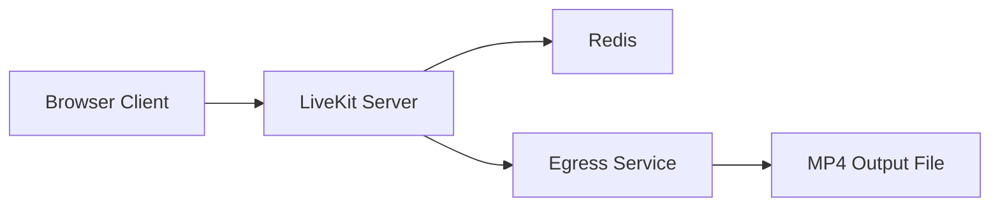
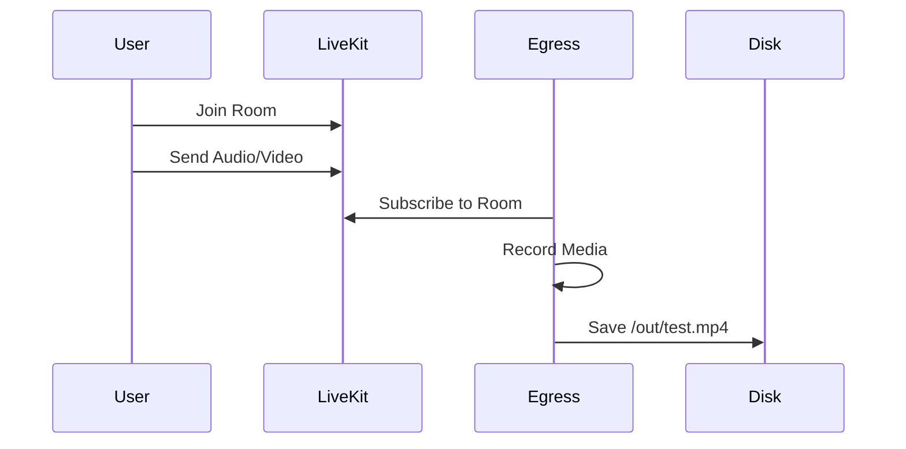

# 🎥 LiveKit Local Recording Setup

<p align="center">
  <b>Record LiveKit rooms locally using Docker, Redis, and Egress</b>
</p>

<p align="center">
  
  
  
  
</p>

---

## ⚡ Clone & Run (Using uv)

> Fast Python environment setup using [`uv`](https://github.com/astral-sh/uv)

### 1. Clone Repository

```bash
https://github.com/MeetAI-india/livekit-local-egress-setup.git
cd livekit-local-egress-setup
```

---

### 2. Install `uv` (if not installed)

```bash
pip install uv
```

---

### 3. Create Virtual Environment & Install Dependencies

```bash
uv venv
source .venv/bin/activate   # macOS/Linux
# .venv\Scripts\activate    # Windows

uv pip install -r requirements.txt
```

---

### 4. Run Token Generator (Optional Test)

```bash
python main.py
```

---

## 📌 Overview

This project demonstrates how to:

* Run **LiveKit locally**
* Join a room using a browser
* Record sessions using **Egress**
* Save recordings as `.mp4`

---

## 🧠 What is LiveKit?

**LiveKit** is an open-source, real-time communication platform built on WebRTC.

It allows you to build:

* 🎥 Video conferencing apps
* 🎙️ Audio chat rooms
* 📡 Real-time streaming systems

### Key Features:

* Low-latency audio/video streaming
* Scalable SFU (Selective Forwarding Unit) architecture
* Server-side APIs for rooms, participants, and media
* Works with web, mobile, and backend services

👉 In this project, LiveKit acts as the **media server** that manages rooms and streams.

---

## 🎬 What is LiveKit Egress?

**LiveKit Egress** is a service that allows you to **export media from a LiveKit room**.

It can:

* 🎥 Record rooms into video files (`.mp4`, `.webm`)
* 🎙️ Capture audio streams
* 📡 Stream to platforms (RTMP, HLS, etc.)

### How it works:

1. Egress **joins your room as a hidden participant**
2. Subscribes to audio/video tracks
3. Records or streams the media
4. Saves output to disk or cloud storage

👉 In this setup, Egress saves recordings to:

```
/out/test.mp4
```

---

## 🏗️ Architecture Diagram



---

## ⚙️ Prerequisites

* Docker & Docker Compose
* Python 3.8+
* LiveKit CLI (`lk`)

---

## 🚀 Quick Start

### 1. Start Services

```bash
docker-compose up -d
```

---

### 2. Verify Server

```bash
curl http://localhost:7880
```

**Expected:**

```
OK
```

---

## 🔐 Generate Access Token

```python
from livekit import api

api_key = "devkey"
api_secret = "secret"

token = api.AccessToken(api_key, api_secret)
token.with_identity("user1")
token.with_grants(api.VideoGrants(
    room_join=True,
    room="test-room",
))

print(token.to_jwt())
```

---

## 🌐 Join Room

Go to: 👉 [https://meet.livekit.io/](https://meet.livekit.io/)

| Field | Value                 |
| ----- | --------------------- |
| URL   | `ws://localhost:7880` |
| Token | Paste generated token |

Click **Connect**

---

## 📄 Create Egress Config

```bash
nano egress.json
```

```json
{
  "room_name": "test-room",
  "file_outputs": [
    {
      "filepath": "/out/test.mp4"
    }
  ]
}
```

---

## 🎬 Start Recording

```bash
lk egress start egress.json \
  --url http://localhost:7880 \
  --api-key devkey \
  --api-secret secret
```

**Output:**

```
EgressID: EG_xxxxx
```

---

## 🧠 Recording Flow Diagram



---

## 🗣️ Speak (Important)

* Stay connected to the room
* Turn **Mic ON**
* Speak for **15–30 seconds**

---

## 🛑 Stop Recording

```bash
lk egress stop \
  --id EG_xxxxx \
  --url http://localhost:7880 \
  --api-key devkey \
  --api-secret secret
```

---

## 📁 Check Output

```bash
ls recordings
```

**Expected:**

```
test.mp4
```

---

## 🔍 Debugging

### View Logs

```bash
docker logs livekit-local-egress-1
```

### Check inside container

```bash
docker exec -it livekit-local-egress-1 ls /out
```

---

## ⚠️ Important Rules

### 🔴 Always Stop Egress

```bash
lk egress stop --id <ID>
```

---

### 🔴 Correct File Path

```json
"filepath": "/out/test.mp4"
```

---

### 🔴 Folder Permissions

```bash
chmod -R 777 recordings
```

---

### 🔴 Must Be Connected

* Browser connected ✅
* Microphone enabled ✅

---

## 📂 Project Structure

```bash
.
├── docker-compose.yml
├── egress.json
├── recordings/
├── main.py
├── requirements.txt
└── README.md
```

---

## ✅ Summary

✔ Clone & setup with uv
✔ Start services
✔ Generate token
✔ Join room
✔ Start recording
✔ Speak
✔ Stop recording
✔ Get file


